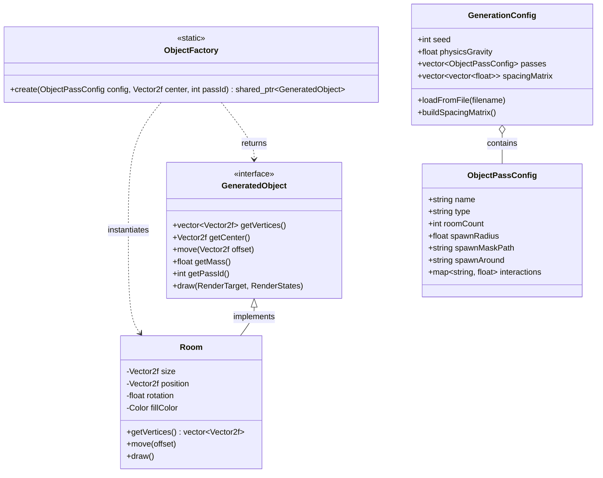
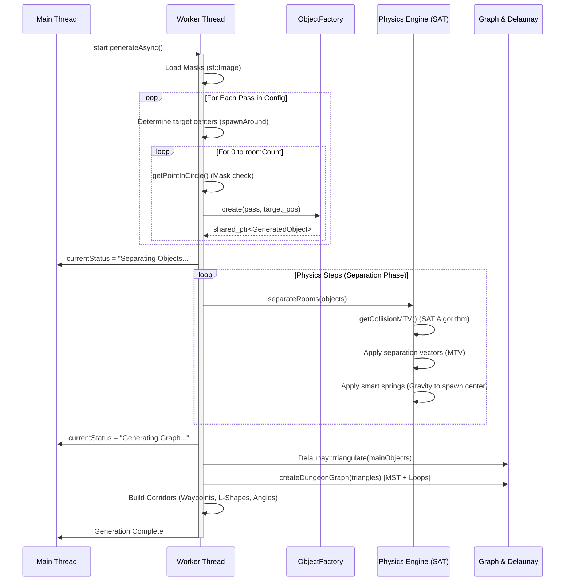
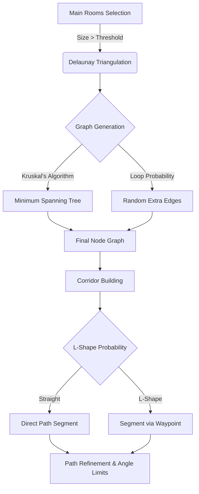

# Архитектура движка sfml-dungeon-gen

Данный документ описывает модульную архитектуру проекта, потоки данных (Data Flow) и алгоритмы, лежащие в основе движка процедурной генерации. Вся структура спроектирована с упором на расширяемость и независимость компонентов (через интерфейсы).

---

## 1. Общая архитектура и модули

Движок разбит на несколько логических слоев:
1.  **Конфигурация (Data Layer):** Загрузка JSON, парсинг параметров проходов (passes) и физических констант.
2.  **Фабрика сущностей (Creation Layer):** Генерация объектов на основе масок и параметров распределения.
3.  **Физический движок (Physics Layer):** Распределение (Separation) объектов через SAT-алгоритм и систему пружин.
4.  **Логика связности (Graph Layer):** Триангуляция Делоне, генерация минимального остовного дерева (MST) и маршрутизация коридоров.
5.  **Презентация (Render Layer):** Рендеринг через SFML (в дальнейшем с интеграцией кастомных шейдеров для слоев "Реальности" и "Пергамента").

### Диаграмма классов (Class Diagram)

---

## 2. Пайплайн генерации (Main Loop)

Генерация выполняется асинхронно в отдельном потоке (`workerThread`), чтобы не блокировать рендер прогресс-бара и UI.

---

## 3. Физический движок (Separation Phase)

Распределение сгенерированных объектов в пространстве — самая тяжеловесная часть. Она решает задачу непересечения комнат и формирования плотной структуры подземелья.

1. **Separating Axis Theorem (SAT):** Для каждой пары объектов `A` и `B` берутся их вершины (`getVertices()`). Алгоритм проецирует вершины на оси (нормали к граням) и ищет ось, где проекции не пересекаются.
2. **Minimum Translation Vector (MTV):** Если пересечение есть по всем осям, вычисляется наименьший вектор, необходимый для выталкивания объектов друг из друга.
3. **Spacing Matrix:** К размерам объектов при расчете MTV добавляется отступ (padding), который вычисляется на основе правил `interactions` из `GenerationConfig` (например, дистанция между объектами pass "rooms" и "halls").
4. **Smart Springs (Умные пружины):** Чтобы объекты не разлетались бесконечно далеко, применяется слабая сила притяжения (на основе `config.physicsGravity`), которая тянет каждый объект обратно к его изначальной точке спавна.

---

## 4. Логика графов и коридоров

### Детали реализации:
* **`Delaunay::triangulate`**: Алгоритм Бойера-Ватсона (инкрементальный). Начинается с огромного "супер-треугольника", затем последовательно вставляет центры главных комнат, перестраивая сетку с условием: ни одна точка не лежит внутри описанной окружности любого треугольника.
* **MST (Minimum Spanning Tree)**: Гарантирует, что все главные комнаты связаны между собой кратчайшим путем без циклов.
* **Коридоры**: Коридоры — это не просто линии, это набор `sf::RectangleShape`. Система вейпоинтов (waypoints) позволяет коридорам "примагничиваться" (snap) к промежуточным комнатам и изгибаться под правильными углами (L-shape).

---

## 5. Система Масок (Spawn Masks)

Одной из главных архитектурных особенностей является контроль формы генерации через изображения (маски).

* **Загрузка:** Изображение загружается через `sf::Image` на этапе подготовки к проходу.
* **Сэмплинг:** Функция `getPointInCircle()` генерирует случайную точку и накладывает её на координаты маски (считая, что центр маски совпадает с `spawnCenter`).
* **Вероятность по яркости:** Берется значение канала Red (от 0 до 255) и переводится в float (0.0 - 1.0). Если случайное число `uDist(0.0, 1.0)` меньше этой яркости, точка одобряется.
  * *Белый пиксель (255):* 100% вероятность спавна.
  * *Черный пиксель (0):* 0% вероятность.
  * *Серый (128):* 50% вероятность.

---

## 6. Связь с GameDesign концепциями (Roadmap)

Архитектура спроектирована с учетом будущего перехода на визуальный стиль и механики Вавилонской Башни (см. `/GameDesign`).

* **Слои рендера (Реальность и Пергамент):** Текущий SFML-рендер будет заменен на отрисовку `GeneratedObject` в две независимые `sf::RenderTexture`. К ним будут применяться шейдеры Кувахары (для реальности) и Edge Detection (для пергамента).
* **Vertex Jittering:** Интерфейс `GeneratedObject` будет расширен методом `getJitteredVertices()`, который добавит микроскопическое смещение к точкам (`sf::VertexArray`) для имитации стоп-моушен анимации.
* **Расширение фабрики:** `ObjectFactory` будет создавать `SafeRoom` (Сады и Балконы), которые будут сбрасывать искажение (панику) при рендеринге графа.
