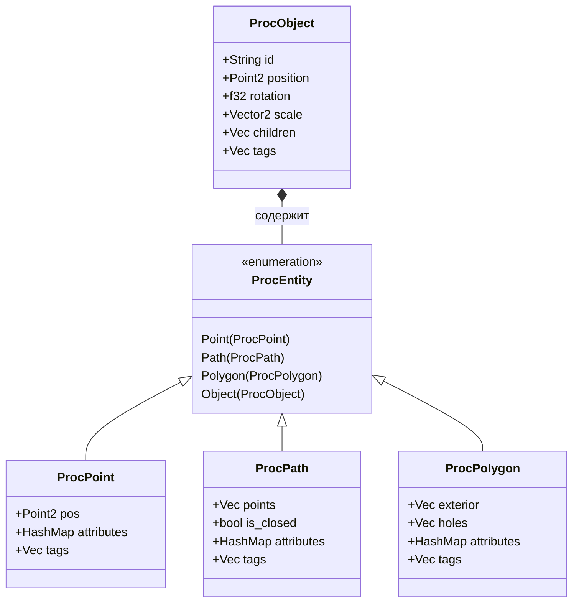
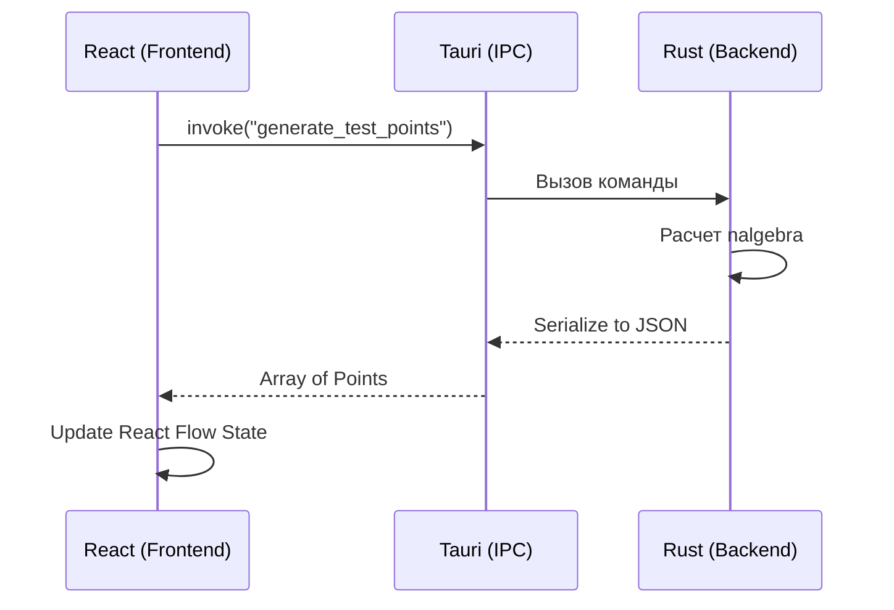

# Project Oversight: ProcEngine V2 🛰

Этот документ является "контрольной башней" проекта. Он предназначен для визуального контроля архитектуры, отслеживания связей и выявления слабых мест без погружения в исходный код.

---

## 1. Архитектура Ядра (Rust Core)
Описывает иерархию данных в `src-tauri/src/engine.rs`.

---

## 2. Карта Взаимодействия (UI <-> Core)
Как данные текут через мост Tauri.

---

## 3. Анализ Здоровья Проекта (Health Check)

| Модуль | Статус | Слабые точки |
| :--- | :--- | :--- |
| **Rust Core** | 🟢 Stable | Нет реализации `ExecutionEngine`. Код пока статичен. |
| **Data Model** | 🟢 Robust | **Слабая точка:** Нет валидации "дырок" в полигонах (могут пересекаться с границами). |
| **IPC Bridge** | 🟡 Testing | Данные передаются массивами. При больших графах JSON может стать "бутылочным горлышком". |
| **Frontend UI** | 🔴 Prototype | **Слабая точка:** Используются inline-стили (JS), Tailwind не настроен до конца. |
| **Node Logic** | 🔴 Missing | Ноды в React Flow — это просто картинки, они не имеют логической связи с Rust. |

---

## 4. Рекомендации "Техлида"
1.  **Срочно:** Настроить `PostCSS`, чтобы уйти от inline-стилей в `App.tsx`. Это засоряет код.
2.  **Важно:** Ввести систему ID для сущностей в Rust, чтобы UI мог обращаться к конкретному объекту в памяти.
3.  **На перспективу:** Начать проектирование `ExecutionEngine` на Rust (топологическая сортировка).

---

## 5. Текущий фокус (Current Sprint)
**Задача PROC-12:** Переход от тестовых точек к реальной системе нод. 
*Следующий шаг:* Создание ноды `PointGenerator` с параметрами.
