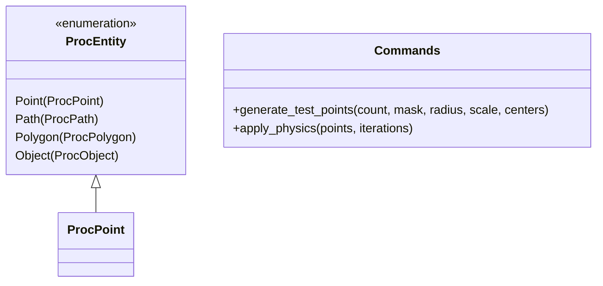
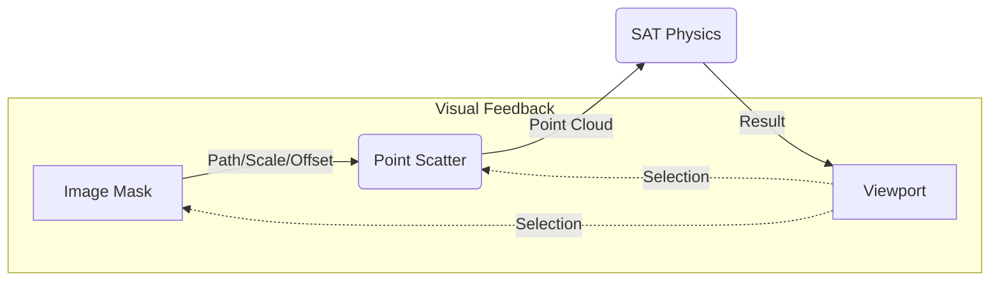

# Project Oversight: ProcEngine V2 🛰

Этот документ является "контрольной башней" проекта. Он предназначен для визуального контроля архитектуры, отслеживания связей и выявления слабых мест.

---

## 1. Архитектура Ядра (Rust Core)
Описывает иерархию данных и команды в `src-tauri/src/engine.rs`.

---

## 2. Слой логики графа (Data Flow)
Текущий рабочий пайплайн данных.

---

## 3. Анализ Здоровья Проекта (Health Check)

| Модуль | Статус | Слабые точки |
| :--- | :--- | :--- |
| **Rust Core** | 🟢 Stable | Поддержка масок, масштабирования и произвольных центров генерации. |
| **Viewport** | 🟢 Interactive| Реализован Zoom, Pan и визуальные маркеры выбранных нод. |
| **Inspector**| 🟢 Advanced | Экспоненциальные шкалы для Count/Radius. Управление центрами объектов. |
| **Data Model**| 🟢 Robust | Структуры на Rust синхронизированы с UI через JSON. |
| **Physics**   | 🟡 Basic | **Слабая точка:** Физика всё еще работает в квадратичной сложности $O(n^2)$. При PTS > 1000 будут фризы. |

---

## 4. Рекомендации "Техлида"
1.  **Срочно:** Реализовать сохранение/загрузку графа. Тестировать сложные маски становится долго из-за необходимости каждый раз собирать цепочку.
2.  **Важно:** Добавить ноду `Shape Constructor`. Нам пора переходить от точек к полигонам (комнатам).
3.  **На перспективу:** Оптимизация Rust-ядра через пространственное хеширование.

---

## 5. Текущий фокус (Current Sprint)
**Задача PROC-12 (Завершение):** Финализация системы связей и переход к сохранению данных.
*Следующий шаг:* Persistence Layer (JSON Save/Load).
